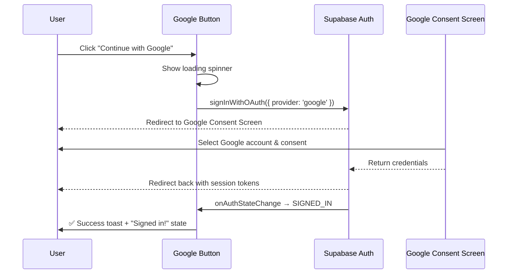

# Supabase Google Authentication — Walkthrough

## What Was Done

Integrated **Google Sign-In** via **Supabase Auth** (`signInWithOAuth`) on the existing login page, replacing the previously planned Firebase approach.

### Files Changed

| File | Action | Purpose |
|------|--------|---------|
| [supabase-config.js](file:///d:/Project/login/supabase-config.js) | **NEW** | Supabase client initialization with real project credentials |
| [login.html](file:///d:/Project/login/login.html) | Modified | Added Supabase JS CDN + toast notification container |
| [login.js](file:///d:/Project/login/login.js) | Modified | Google OAuth handler, toast system, auth state listener |
| [login.css](file:///d:/Project/login/login.css) | Modified | Toast notification + button loading/success styles |

### Authentication Flow



> [!NOTE]
> Unlike Firebase (which uses a popup), Supabase uses a **redirect-based OAuth flow**. The user is redirected to Google, then back to your page with the session.

## ⚠️ Required Setup — Enable Google Provider

> [!CAUTION]
> You **must** enable Google as an auth provider in your Supabase dashboard before this will work:

1. Go to your **[Supabase Dashboard](https://supabase.com/dashboard/project/nqfnnihztqudfmxubtpt/auth/providers)**
2. Find **Google** under Auth → Providers → click to expand
3. Toggle **Enable** to ON
4. Enter your **Google Client ID** and **Client Secret**
   - Get these from [Google Cloud Console → Credentials → OAuth 2.0 Client IDs](https://console.cloud.google.com/auth/clients)
   - Set **Authorized redirect URI** to: `https://nqfnnihztqudfmxubtpt.supabase.co/auth/v1/callback`
5. Click **Save**

### Key Code Changes

**[supabase-config.js](file:///d:/Project/login/supabase-config.js)** — Uses your real `hackathon` project:
```js
const supabaseClient = supabase.createClient(SUPABASE_URL, SUPABASE_ANON_KEY);
```

**[login.js](file:///d:/Project/login/login.js)** — OAuth call:
```js
const { data, error } = await supabaseClient.auth.signInWithOAuth({
    provider: 'google',
    options: { redirectTo: window.location.origin + window.location.pathname },
});
```

## How to Test

1. Enable Google provider in Supabase dashboard (steps above)
2. Open [login.html](file:///d:/Project/login/login.html) via **Live Server**
3. Pull the lamp chain → click **"Continue with Google"**
4. Google consent screen appears → sign in
5. Redirected back → success toast shows with your name
